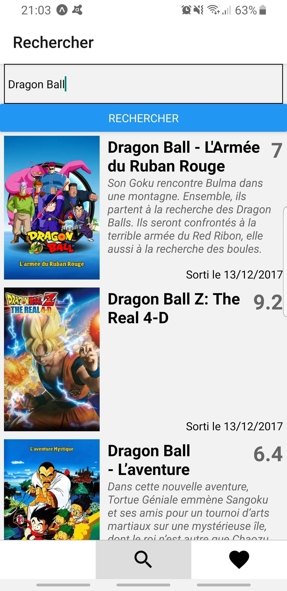
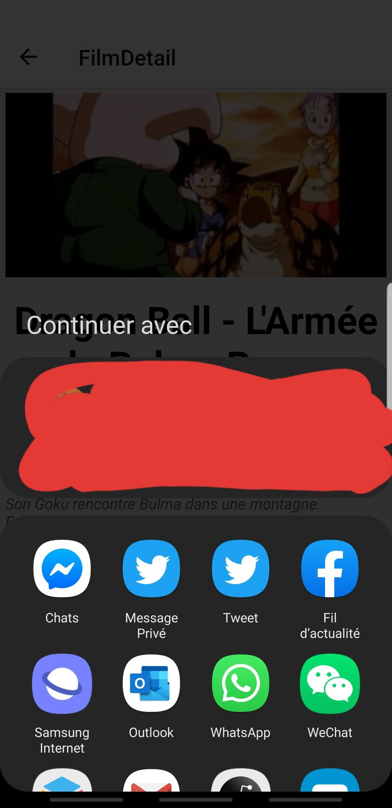
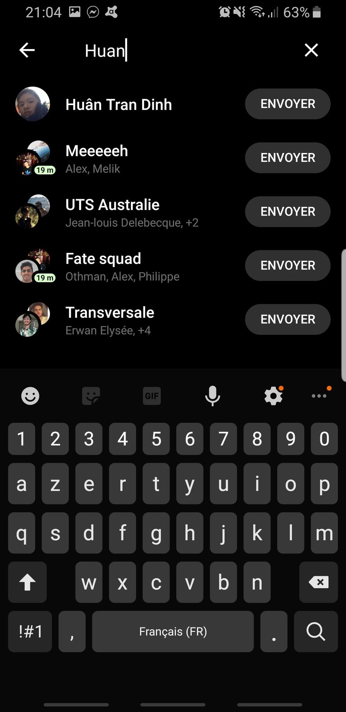
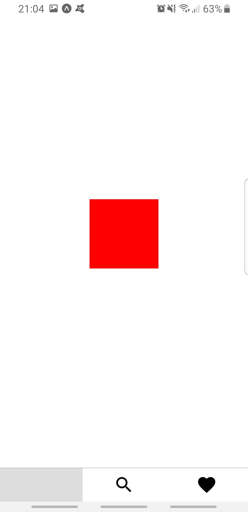
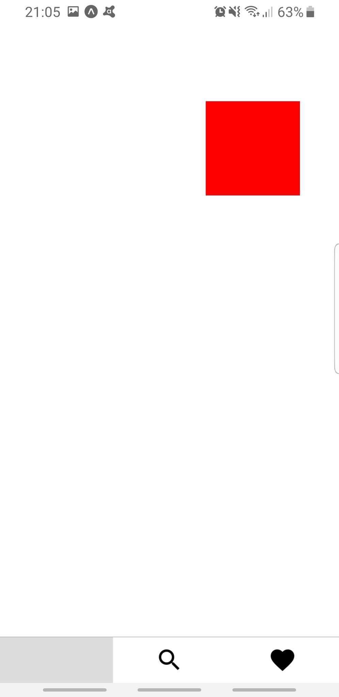

# MoviesandMe

First, you need to install the expo app on your phone.

Then, to start:

npm install

npm start

Preuves et démo (Idem pour la version IOS sur la branche ios_app, la différence est juste le téléphone qui est un iphone simulé sur mon téléphone):

On cherche les films Dragon Ball:

On en sélectionne un et on regarde les détails:

On le met en favoris:

Il a été ajouté aux favoris:

Le bouton share nous propose différents moyens de partage:

Je décide d'envoyer à moi-même le détail du film sélectionné sur Messenger:

On a la réception comme prévu sur Messenger:

Cet onglet n'a pas d'utilité, il a seulement été utilisé dans le cours pour tester une notion sur le tactile:

Dans un autre usage, il permet à l'utilisateur de déplacer les éléments sur l'aplication comme il le souhaite avec son doigt:

